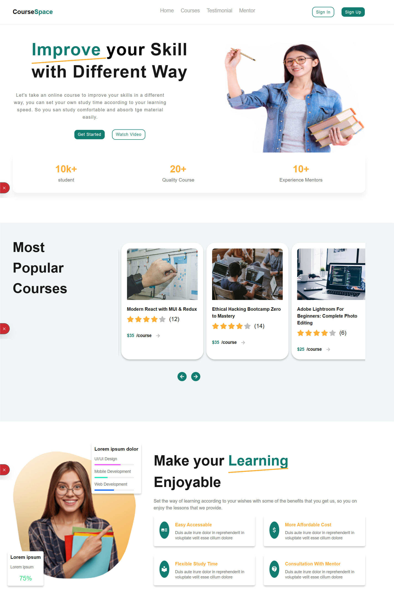
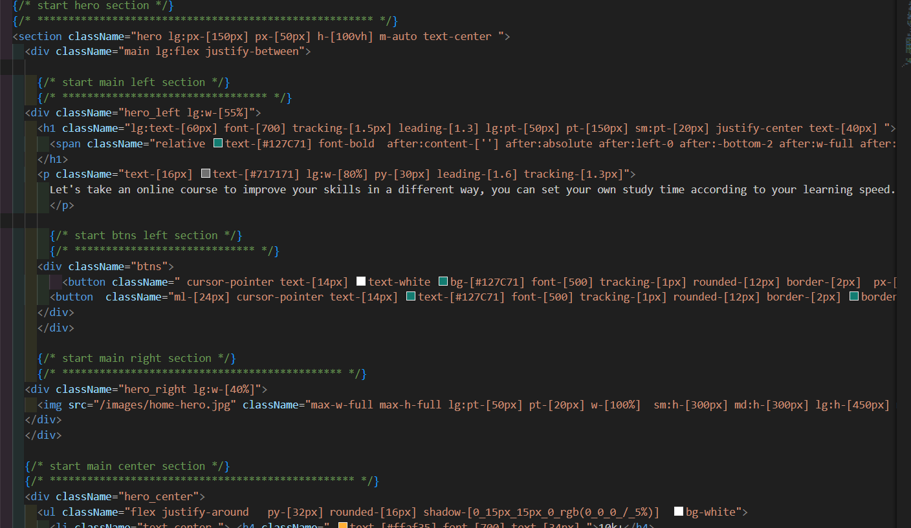

This project was developed using Next.js and styled with Tailwind CSS.
It is fully responsive, ensuring a smooth user experience across all screen sizes and devices.

⚡ Key Features

Implemented SSR (Server-Side Rendering) for dynamic data fetching.

Built Client-side rendering features for interactive components.

Clean and modern UI with Tailwind CSS utility classes.

Optimized for speed, scalability, and maintainability.

📱 Responsiveness

The design adapts seamlessly to mobile, tablet, and desktop screens with a focus on usability and accessibility.
This is a [Next.js](https://nextjs.org) project bootstrapped with [`create-next-app`](https://github.com/vercel/next.js/tree/canary/packages/create-next-app).



## Getting Started

First, run the development server:

```bash
npm run dev
# or
yarn dev
# or
pnpm dev
# or
bun dev
```

Open [http://localhost:3000](http://localhost:3000) with your browser to see the result.

You can start editing the page by modifying `app/page.js`. The page auto-updates as you edit the file.

This project uses [`next/font`](https://nextjs.org/docs/app/building-your-application/optimizing/fonts) to automatically optimize and load [Geist](https://vercel.com/font), a new font family for Vercel.


## 🚀 Live Demo
[](https://courses-space1-git-main-manal182021s-projects.vercel.app/)

## 🛠️ Built With


